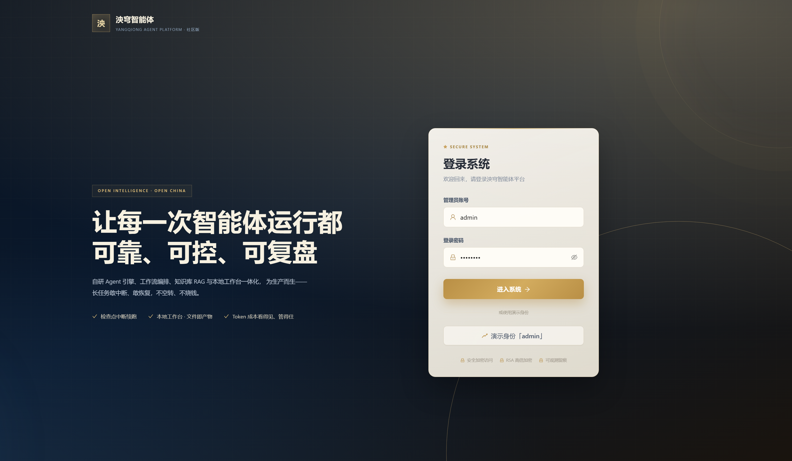
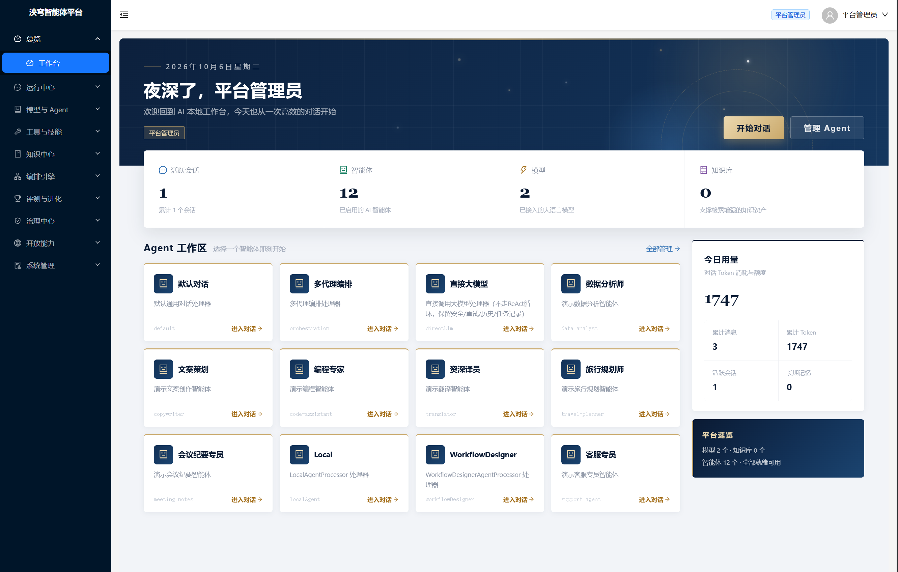
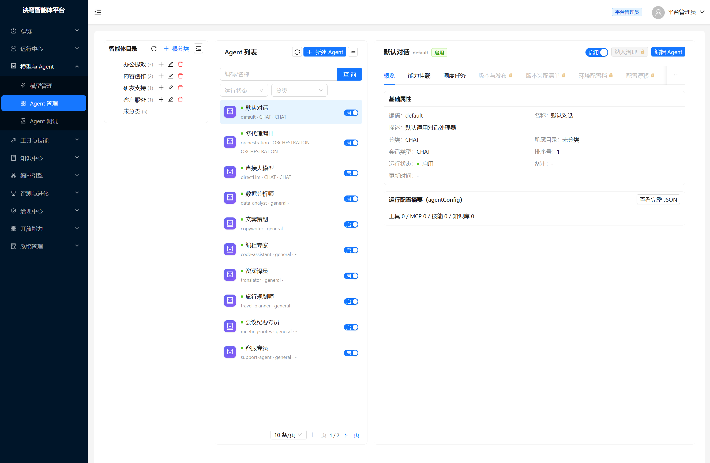
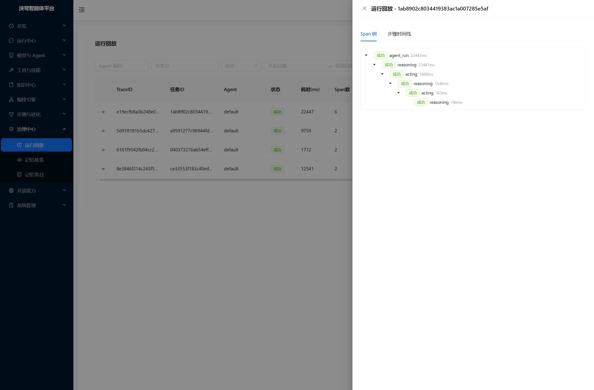
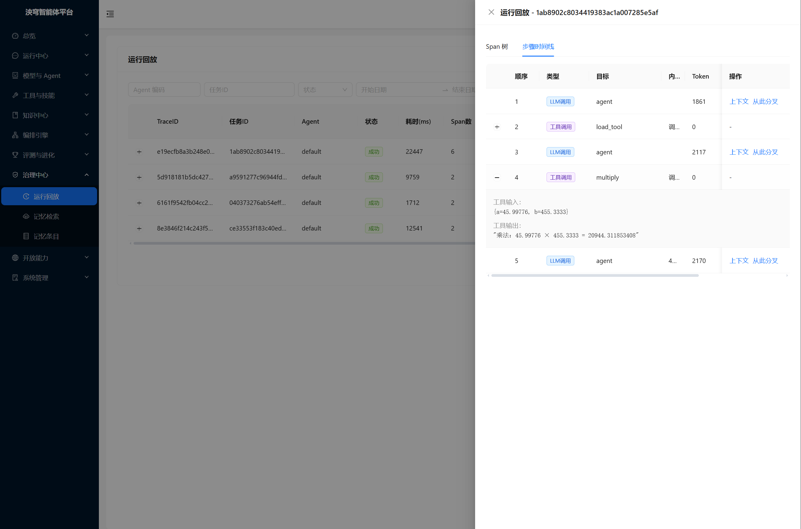

# 泱穹智能体平台（YangQiong Agent Platform）社区版

泱穹智能体平台社区版：一个把"生产级可靠性"当作第一优先级的开源智能体（Agent）开发平台。自研 Agent 引擎 + 工作流编排 + 知识库 RAG + 本地工作台 + 能力开放平台一体化，原生支持审批暂停恢复、澄清追问、检查点断点续跑与成本治理——不是又一个对话 Demo，而是能放心接入业务的智能体底座。

## 🌟 亮点速览

- **为可靠性而生**：检查点 + 运行锁 + 幂等去重 + 终态错误治理四重保障，长任务敢中断、敢恢复、不空转烧钱
- **本地工作台，文件即产物**：AI 在工作区目录内读写真实文件，产物落盘、可预览、可下载，写删操作受审批管控
- **人机协作不丢上下文**：审批与澄清内联在对话流中完成，批准/回答后从暂停现场无缝续跑
- **成本看得见、管得住**：Token 消耗逐次落库可对账，异常自动熔断兜底，杜绝"成本黑盒"
- **开箱即用、按需扩展**：仅 MySQL 即可跑通核心链路，MinIO / Neo4j / 向量库可选接入，未启用自动降级
- **一行命令开放集成**：统一开放 API 直接调用 Agent 与工作流，SSE 流式 + 异步任务，端点动态发现免翻文档
- **单体轻部署**：Spring Boot 单体 + React 管理台，资源要求低，小团队也能轻松运维

## ✨ 核心特性

### 可靠执行内核
- **检查点断点续跑**：每轮对话自动落检查点（乐观锁防并发），检查点/审批/运行锁支持分布式共享存储，跨节点也能恢复现场——长任务敢于中断、敢于恢复
- **运行锁与幂等执行**：跨节点运行锁与超时接管，工具调用幂等键去重，重复触发不重复执行
- **终态错误治理**：余额不足、鉴权失败等终态错误短路处理，不空转重试烧钱，真实原因透传到前端

### 人机协作
- **工具调用审批**：审批不阻塞上下文——对话流内联审批卡片，异步事件驱动，批准后从暂停现场恢复续跑；支持工作台级与 Agent 级两级审批策略
- **澄清追问**：Agent 不确定时主动提问，答案注入后恢复执行，支持多轮澄清

### 本地工作台

- **工作区即沙箱**：AI 仅在工作区目录内读写真实文件，支持云端工作区、本地连接器、浏览器直连三种接入，写删操作受审批管控
- **文件即上下文**：文件树右键把文件加入对话（单次最多 5 个），Agent 增删改文件后自动刷新；输入框可粘贴图片（≤5MB）多模态发送
- **产物即见即得**：每轮回复自动对比快照，新产物挂载到消息下点击即预览；文本可编辑，图片 / Excel / Word / zip / PDF 只读预览，删除可从回收站恢复

### 编排与调度
- **工作流编排**：多节点可视化编排，节点级状态持久化，执行进度可查询
- **定时任务**：Cron 驱动 Agent 与工作流定时执行，连续失败自动熔断暂停，避免深夜空烧

### 知识库与技能
- **知识库 RAG**：文档切片入库、向量检索、多数据源接入，Agent 对话自动引用知识片段
- **技能治理**：技能即资产——版本快照与内容指纹、一键回滚、LLM 四维质量评分、能力退化监控告警

### 智能体管理与对话
- **Agent 版本与配置档管理**：环境配置档按需组合切换模型/温度/工具/技能/知识库，Agent 支持版本管理与回滚；技能、MCP、工具、知识库均以分类树组织，规模化管理不混乱
- **会话质量保障**：流式输出、上下文智能治理保证长会话不跑偏不超限、知识引用可溯源

### 能力开放平台
- **统一开放 API**：一行 curl 调用 Agent 或工作流，同一入口按能力执行体自动路由，支持异步任务与 SSE 流式返回（Agent 能力）
- **端点动态发现**：能力详情直接返回可调用端点列表，调用方拼接服务地址即可集成，无需翻对接文档

### 成本与可观测
- **Token 消耗落库可对账**：每次调用成本看得见，配合熔断机制杜绝"成本黑盒"
- **指标与链路**：Actuator + Prometheus 指标暴露，调用留痕与链路追踪

### 开箱即用
- **优雅降级**：仅 MySQL 即可完整跑通核心链路，MinIO / Neo4j / 向量库按需接入，未启用时相关功能自动禁用，核心对话不受影响
- **版本化迁移**：Flyway 自动建表与升级，初始化脚本一键创建 69 张核心表，从零启动到可用无需手工建库

## 📦 模块结构

```
yangqiong-ai/
├── yangqiong-ai-framework/          # 自研 Agent 引擎与框架层（Agent 内核/工作流/RAG/开放能力/审批）
├── yangqiong-ai-platform/           # 平台业务能力层（认证/知识库/会话/集成/系统管理）
├── yangqiong-ai-server/             # 服务启动模块（Spring Boot 单体，端口 8082）
├── yangqiong-ai-front-community/    # 前端管理后台（React 18 + Ant Design，端口 3001）
└── yangqiong-ai-front-libs/         # 前端组件层
```

## 🔧 环境要求

- JDK 17
- MySQL 5.7 及以上（首次启动自动执行 Flyway 迁移建表）
- Node.js >= 18.0.0、pnpm >= 9.0.0（前端）

可选依赖按需启用：MinIO（对象存储，未启用时相关功能自动禁用）、Qdrant（向量库，通过环境变量 `QDRANT_HOST` 指向实际主机）、Neo4j（图谱，默认关闭）、Redis（缓存，默认关闭）。

## 🚀 快速开始

### 一键启动包（免安装，推荐体验）

不想装环境？直接从 GitHub Release 下载对应平台的一键启动包，解压即用。包内已内置精简 JRE、MySQL、Redis、Qdrant、后端程序与前端页面，无需安装任何依赖：

| 平台 | 下载文件 | 大小 |
|---|---|---|
| Windows | `yangqiong-ai-community-quickstart-win-x64.zip` | 约 265 MB |
| Linux x86_64 | `yangqiong-ai-community-quickstart-linux-x86_64.tar.gz` | 约 280 MB |

下载地址：<https://github.com/yangqiongai/yangqiong-ai/releases>

**使用方法**

- Windows：解压后双击 `start.bat`，浏览器自动打开 <http://localhost:8082>
- Linux：解压后执行 `./start.sh`（无需 root），浏览器访问 <http://localhost:8082>
- 默认账号：`admin / 123456`
- 停止服务：Windows 双击 `stop.bat`；Linux 执行 `./stop.sh`

首次启动会自动完成密钥生成、MySQL 初始化建库与 Flyway 表结构迁移，耗时较长属正常现象，后续启动明显加快。

**内置服务与端口**（全部仅监听本机，使用非官方端口避免冲突）

| 服务 | 地址 | 说明 |
|---|---|---|
| 应用入口 | <http://localhost:8082> | 前端 + API 同源 |
| MySQL | `127.0.0.1:23306` | 免安装，`mysql/data/` 为数据库文件 |
| Redis | `127.0.0.1:16379` | 会话 / 工作流状态缓存 |
| Qdrant | `127.0.0.1:16333/16334` | 向量数据库 |
| SeaweedFS | 可选捆绑 | S3 兼容对象存储，默认不捆绑，文档上传到本地目录 `data/files` |

**目录说明**：`jre/` 内置精简 Java 运行环境；`app/` 后端程序；`web/` 前端页面；`conf/` 外置配置 `application-quickstart.yml`；`logs/` 运行日志；`cache/djl/` RAG 向量模型缓存（首次使用知识库自动联网下载约 400 MB，之后可离线使用）。

**升级与卸载**：升级前停止服务并备份 `mysql/data/`、`data/files/`、`qdrant/storage/`、`redis/data/`、`cache/djl/`、`conf/`、`run/`，解压新包后覆盖回对应位置再启动；卸载直接删除整个目录即可，无注册表与系统服务残留。

> 提示：如遇端口占用、防火墙提示、MySQL 初始化失败等常见问题，详见包内 `README.txt`。

### 后端

```bash
cd yangqiong-ai-server
mvn spring-boot:run
```

默认数据库为本地 `root/123456`，可通过环境变量或 `application-local.yml` 覆盖。

### 前端

```bash
cd yangqiong-ai-front-community
pnpm install
pnpm dev:admin
```

访问 <http://localhost:3001>，使用种子账号 `admin/123456` 登录。

### Docker 一键部署

```bash
cd yangqiong-ai-docker
docker compose up -d
```

默认编排包含 MySQL、Redis、Qdrant、后端与前端；文件存储使用本地目录（`backend-data` 卷），文档解析使用内置 Tika。首次启动自动建库建表，完成后访问 <http://localhost:3001>（种子账号 `admin/123456`）。

可选组件按需启用：

- **对象存储（MinIO / S3 兼容）**：MinIO 社区版镜像已从 Docker Hub / quay 下架（官方仅保留源码分发，AIStor 免费版需注册 license），故默认编排未包含。如需启用，可自行准备 MinIO 或任意 S3 兼容存储并添加服务，将后端环境变量改为 `AI_STORAGE_TYPE=minio`，并配置 `AI_STORAGE_MINIO_ENDPOINT`、`MINIO_ACCESS_KEY`、`MINIO_SECRET_KEY`（存储桶名默认 `yangqiong-ai`）。未启用时文件自动落盘本地目录，不影响核心功能。
- **文档解析（Docling）**：默认降级为内置 Tika 解析（支持常见文档格式）。如需更强的 PDF 解析效果，可添加服务 `docling`（镜像 `ghcr.io/docling-project/docling-serve`，端口 5001，内置解析模型体积较大），并将后端环境变量 `AI_RAG_DOCLING_URL` 设为 `http://docling:5001`。
- **向量库（Qdrant）**：已内置并默认启用（gRPC 端口 6334）；使用外部已有实例时，通过 `QDRANT_HOST` / `QDRANT_PORT` 指向实际主机即可。

## 安全提示

仓库内配置文件中的 JWT 密钥、RSA 密钥对、数据库 / Redis / MinIO / Neo4j 密码均为**本地开发默认值**，生产部署必须通过环境变量覆盖（如 `AUTH_JWT_SECRET`、`AUTH_RSA_PRIVATE_KEY` 等），并修改所有中间件默认凭据。

## 📖 文档

详细指南与示例见官网 <https://yangqiongai.com>。


## 🖥️ 系统预览

**登录门户** —— 墨蓝 × 鎏金的一体化登录界面



**工作台总览** —— 智能体工作区与当日用量



**智能体管理** —— 目录分组 · 智能体列表 · 配置详情



**运行回放 · Span 树** —— 多层调用链嵌套与耗时分布



**运行回放 · 步骤时间线** —— LLM / 工具调用序列、输入输出与 Token 消耗



## 开源许可与商业授权

本项目采用双许可（Dual Licensing）模式发布：

1. **开源许可（AGPL-3.0）**：您可以依据 [GNU AGPL-3.0](./LICENSE) 使用、修改和分发本项目。AGPL-3.0 允许商业使用，前提是履行其开源义务——包括通过网络提供服务时，向用户开放您修改版本的源代码（AGPL-3.0 第 13 条）。
2. **商业许可（Commercial License）**：如果您希望在不履行 AGPL-3.0 开源义务的前提下将本项目用于商业用途（例如将修改版本闭源、嵌入专有产品、或作为闭源 SaaS 对外提供服务），需获取单独的商业许可，详见官网[商业授权说明](https://yangqiongai.com/license.html)。

即：愿意开源（遵守 AGPL-3.0）→ 可免费商用；希望闭源 → 需购买本项目的商业许可。更多高级功能如多租户与组织管理、配额与用量计费、SSO 企业身份集成、高可用集群部署、治理中心增强（治理看板 / 审批中心 / 触发器）、企业级知识库问答（文档问答 / RAG 问答）、知识图谱、Text2SQL 数据问答、工作流增强版等增值能力位于商业版，另行授权。

## 社区与反馈


- **官网**（架构详解、扩展指南、可运行示例）：<https://yangqiongai.com>
- **问题反馈**：[反馈指南](https://yangqiongai.com/feedback.html)；安全漏洞请勿公开披露，邮件至 1781618435@qq.com（标题注明【安全漏洞】）
- **技术交流 QQ 群**：1107572553（用于交流）
- **GitHub 地址**：<https://github.com/yangqiongai>
- **Gitee 地址**：<https://gitee.com/yangqiongai>
